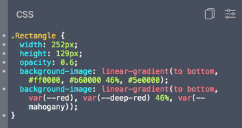

<p align="center">
    
</p>

# Zeplin Extension Documentation ⚗️📚

Zeplin extensions are JavaScript modules that generate code snippets from various design elements. All code snippets you interact with in Zeplin are generated using extensions and they're curated at [extensions.zeplin.io](https://extensions.zeplin.io).

If you're interested in developing your own Zeplin extension, this documentation covers the basics of building one along with a [tutorial](tutorial.md) and discusses their capabilities.

Ping us at [extensions@zeplin.io](mailto:extensions@zeplin.io) if you'd like us to publish your extension at [extensions.zeplin.io](https://extensions.zeplin.io) or if you have any questions—we'd love to hear what you're building!

If you just want to try out extensions and ended up here by mistake, head to [extensions.zeplin.io](https://extensions.zeplin.io) to browse them.

☝️ _Friendly reminder: This documentation will likely change as we polish things during the beta._

## What is an extension?



Extensions are JavaScript modules that implement various functions to generate code snippets from models.

In the example above, Zeplin invokes the `layer` function of the extension, passing the selected layer object as a parameter. Returned value is then displayed. Code highlighting is performed by Zeplin, extensions only communicate the preferred language.

## Getting started

[zem](https://github.com/zeplin/zem), Zeplin extension manager, is a command line tool that lets you quickly create and test  extensions.

If you have npm 5.2+ installed, you can run zem directly to create one:

```sh
npx zem create my-extension
```

Under `my-extension`, zem will generate the initial project structure:

```
my-extension
├── README.md
├── package.json
└── src
    └── index.js
```

#### `index.js`

Default entry point for the extension, a JavaScript document that exports functions, corresponding to different actions. To name a few:

- `styleguideColors`: Generates snippets from Styleguide colors.
- `layer`: Generates snippets from layers.

[See `Extension` documentation](model/extension.md) for all the functions and their details.

#### `package.json`

npm's `package.json` defines everything you, and Zeplin, need to know about an extension, along with its dependencies.

Apart from with basic information like name and description, under the `zeplin` key, extensions can also define options.

[See `package.json` documentation](package.md) for details.

### Running an extension

zem also lets you run an extension in the command line, during development. You can execute functions with sample data and observe the results, without running the extension inside Zeplin.

To learn more about zem, [see documentation](https://github.com/zeplin/zem).

## Your first extension

We've prepared a tutorial to guide you through your first Zeplin extension, dive in:

<h3 align="center">
    🎓 [View tutorial](tutorial.md)
</h3>

## Models

Quickly jump to the documentation of a particular model to learn more about it.

- [`Extension`](model/extension.md)
- [`Context`](model/context.md)
- [`Project`](model/project.md)
- [`Color`](model/color.md)
- [`Gradient`](model/gradient.md)
- [`ColorStop`](model/colorStop.md)
- [`TextStyle`](model/textStyle.md)
- [`Layer`](model/layer.md)
- [`Fill`](model/fill.md)
- [`Border`](model/border.md)
- [`Shadow`](model/shadow.md)
- [`Blur`](model/blur.md)

## Examples

### React Native

[zeplin/react-native-extension](https://github.com/zeplin/react-native-extension)

React Native extension used in Zeplin, used by thousands of developers everyday. It's a full-fledged extension example, generating React Native JavaScript snippets from colors, text styles and layers.

_Check back later for more examples—the plan is to open source most of our existing extensions._
